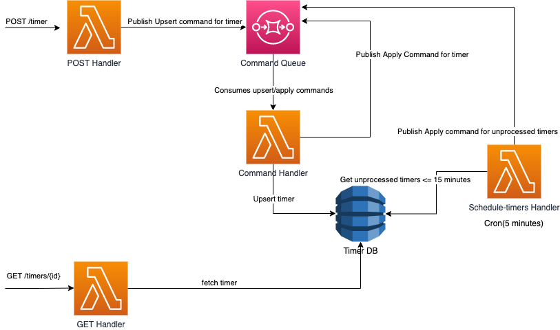

# Timer-api

This project allows users to specify an url with time requirements, in which the post request will be made to this url in the future based on the time requirements.

For example:
- POST /timers {hours: 4, minutes: 0, seconds: 1, url: "https://someserver.com" } should return {id: "b1ffb879-2cc4-4cae-b906-45fccb03e3a2"}
- After 4 hours and 1 second, server should call POST https://someserver.com/b1ffb879-2cc4-4cae-b906-45fccb03e3a2

There are two main edge cases to this project you will need to know about. Since this has been developed with amazon sqs, the longest time a queued message can be delayed is 15 minutes.
- If the posted timer is within 15 minutes, it will be saved in the database and published to the sqs with the delay.
- If the posted timer is above 15 minutes, this will save the timer to the database and a lambda running a cron job will fill the sqs queue every 5 minutes with outstanding timers to be processed.

## Features

- A “Set timer” endpoint.
    - Receives a JSON containing hours, minutes, seconds and web url.
    - This endpoint returns a JSON with a single field - “id".
    - This endpoint defines an internal timer, which shoots a webhook to the defined URL after the time ends (a POST HTTP call with an empty body).

- A “Get timer status” endpoint
    - Receives timer id in the URL, as the resource id
    - Returns a JSON with the amount of seconds left until the timer expires. If timer already expired, returns “0”
- The timers persist.
- If we shut down the process and restart it, timers are saved.
- If a timer should have fired when the server is down, the server fires the web hook after initializing.


## Run Locally

Install dependencies

```bash
  npm install
```

Install serverless dynamodb locally

```bash
  sls dynamodb install
```

Setup local sqs queue (You will need docker running for this)

```bash
  npm run setUpLocalSqs
```

Create local sqs queue

```bash
  npm run createLocalSqsQueue
```

Start the server

```bash
  npm run local:start
```

Set a timer

```bash
  curl -X POST http://localhost:3000/timer  --data '{ "hours": 0, "minutes": 17, "seconds": 3, "url": "https:www.google.com" }' 
```

Get a timer

```bash
  curl http://localhost:3000/timers/{id-returned-from-set-timer-above}
```

### Note
You may see sqs or java main thread errors after running `npm run local:start`, please ignore and still follow the instructions above.
## Deployment
This project has already been deployed and is running in AWS at the url https://bmjt7hm6v2.execute-api.eu-central-1.amazonaws.com.
To test this please run the commands below.

Set a timer
```bash
  curl -X POST https://bmjt7hm6v2.execute-api.eu-central-1.amazonaws.com/timer  --data '{ "hours": 0, "minutes": 17, "seconds": 3, "url": "https:www.google.com" }' 
```

Get a timer

```bash
  curl https://bmjt7hm6v2.execute-api.eu-central-1.amazonaws.com/timers/{id-returned-from-set-timer-above}
```
Alternatively, to test this project in your own deployed AWS environment, please follow the instructions below:

As you may already be aware, this project uses the serverless framework. To deploy this project you would need to setup your local aws configuration as:

```bash
aws configure
```

```bash
[profile dev]
role_arn=<your-role-arn>
source_profile=default
region=eu-central-1
```

```bash
  npm run deployDev
```

## System Design

## Tech Stack

**Server:** Typescript, Node.js, Serverless framework, AWS.

## Authors

- [@Jack Burke](https://www.github.com/JBSWE)
